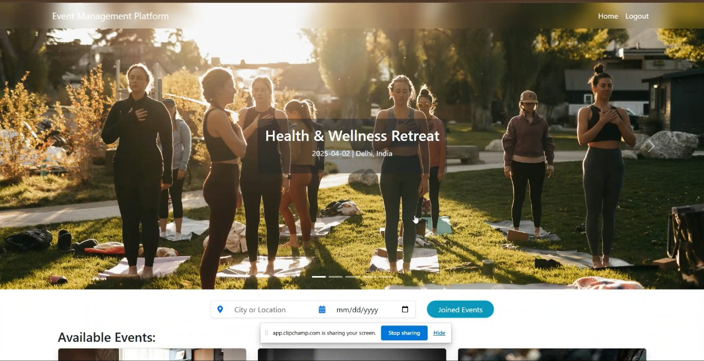

# 🌐 Event Management Platform

A powerful, role-based event management system built with **Django (Backend)** and **React + Vite (Frontend)**, JWT-based authentication with protected routes and scheduled email reminders via AWS Lambda and deployed with a production-grade AWS CI/CD infrastructure.

🎥 **Demo Video**: [Watch on YouTube](https://www.youtube.com/watch?v=A69P-NmbC1s)
---

## 🧠 Table of Contents

- [Overview](#overview)
- [Roles and Features](#roles-and-features)
- [Reminders and Notifications](#reminders-and-notifications)
- [Password Reset Feature](#password-reset-feature)
- [Deployment Architecture](#deployment-architecture)
  - [Frontend Deployment](#frontend-deployment)
  - [Backend Deployment](#backend-deployment)
  - [Database and Monitoring](#database-and-monitoring)
- [Tech Stack](#tech-stack)
- [Getting Started](#getting-started)

---

## 🚀 Overview

This is a role-based event management platform where users can RSVP to events, receive reminder emails, and filter events based on **date** and **location**. The platform ensures scalable and secure deployment using AWS services like ECS Fargate, CloudFront, RDS, Lambda, and more.

---

## 👥 Roles and Features

### 🧑‍💼 User
- RSVP to events with statuses: **Going**, **Not Going**, **Might Go**
- View public events
- Filter events by **date** and **location**

### 💎 Premium User
- All features of the basic user
- Access **Premium Events** earlier than regular users

### 🛠️ Admin
- Create, update, and delete events
- Mark events as **Premium**
- View event guest lists
- Remove RSVPs of any user

---

## 📩 Reminders and Notifications

- RSVP'd users receive **email reminders** a day before their events
- Implemented via **AWS Lambda** and **EventBridge**
  - Lambda containerized and pushed to ECR
  - Triggered daily by EventBridge to check and notify upcoming RSVPs

* Notification via Mail


---

## 🔐 Password Reset Feature

Users can request a password reset via email. The tokenized link allows secure password update through the frontend.
Here's how it works:

1. The user submits their email via a POST request.
2. If the email is valid and matches a registered user, the backend:
   - Encodes the user’s ID and generates a secure token.
   - Creates a password reset link using these credentials.
   - Sends the link to the user’s email address.
3. When the user clicks the link, they're taken to a reset form on the frontend.
4. They can enter a new password, which is securely validated and saved if the token is still valid.

* Password Reset request via mail


---

## 🏗️ Deployment Architecture


### 🖼️ Frontend Deployment

- Hosted using **AWS S3 + CloudFront**.
- **CodeBuild** triggered via **GitHub Webhook** on every push.
- Old artifacts are deleted from the S3 bucket and replaced with new ones.
- CloudFront automatically reflects the changes.

### 🔧 Backend Deployment

- Two separate AWS **CodePipelines**:
  - **Pipeline 1**: Triggered on GitHub push → Builds Docker image → Pushes to ECR.
  - **Pipeline 2**: Triggered on new ECR image tag → Deploys to ECS cluster.
- ECS Cluster is **monitored using CloudWatch**.

### 🛢️ Database and Monitoring

- **Amazon RDS PostgreSQL** used.
- Enhanced monitoring enabled via **CloudWatch**.
- Indexes created on columns for faster filtering.
- DB instances restored using **snapshots** if required.

---

## 🐳 Docker Integration for Full Stack

This project uses **Docker** for consistent and portable builds:

- **Backend**: Dockerized Django app.
- **Frontend**: Dockerized React + Vite app.
- **Lambda (Reminder Scheduler)**: Packaged as a Docker image for AWS Lambda, scheduled via EventBridge.

All Docker images are built and pushed to **AWS ECR** using CodeBuild pipelines, ensuring seamless deployments and version control.

---

## 🔐 Authorization

Used **JWT (Bearer Token)** authentication:
- Users receive a JWT token on login.
- All protected routes require a valid token in the header.

---

## 🛠️ Tech Stack

- **Frontend**: React, Vite, Axios, Bootstrap
- **Backend**: Django, Django REST Framework
- **Database**: PostgreSQL (AWS RDS)
- **Authentication**: JWT + Bearer Token
- **DevOps**: AWS ECS, ECR, CodeBuild, CodePipeline, Lambda, EventBridge, CloudWatch, S3, CloudFront
- **Notifications**: Django email system (SMTP)

---

## 🚀 Getting Started

### Prerequisites

- Docker
- AWS CLI
- Node.js & npm
- Python & pip

### Setup Steps

1. Clone the repository
```bash 
git clone https://github.com/RajaKunalPandit1/Event-Management-Platform.git
cd event-management-platform
```
2. Backend Setup
```bash 
cd backend/
docker build -t event-backend .
docker run -p 8000:8000 event-backend
```
3. Frontend Setup
```bash 
cd ../src/
npm install
npm run dev
```

4. Deploy to AWS
```bash 
# Push your changes to GitHub and let AWS CodePipeline handle the rest 
```
# 📸 Screenshots

* Home Page


* Dashboard with Integrated Carausel
  


* Events View of an Admin
  


* Update Event
  


---

